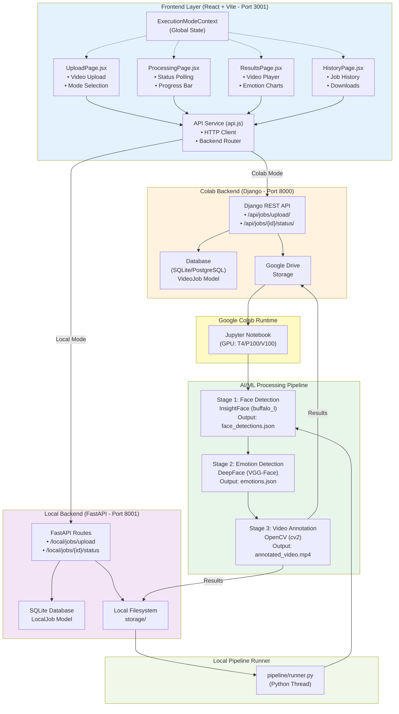
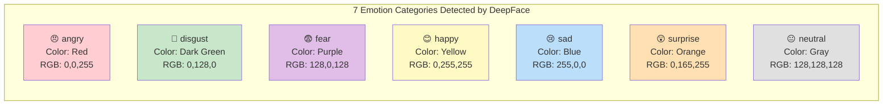
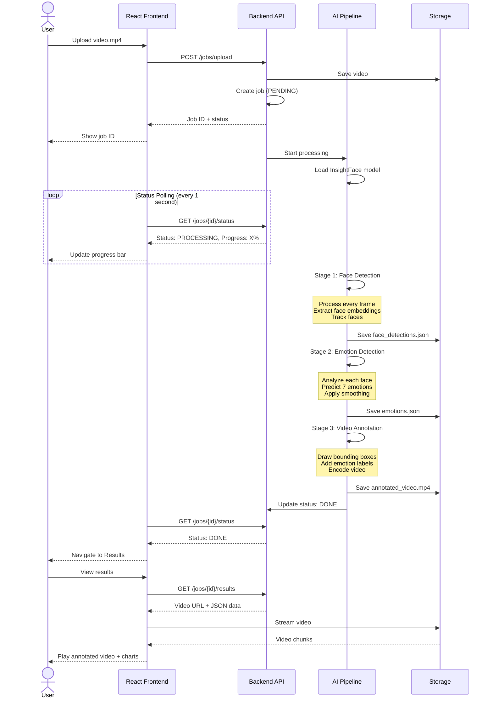
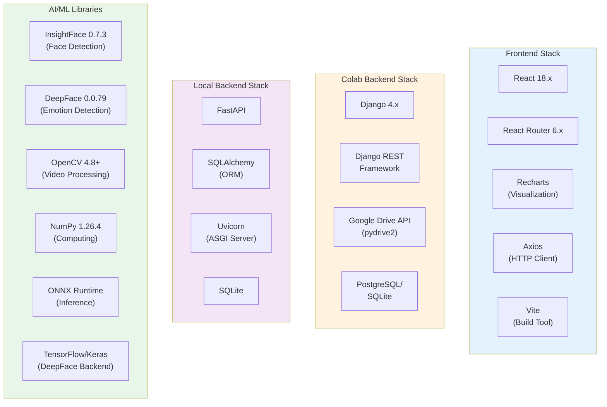
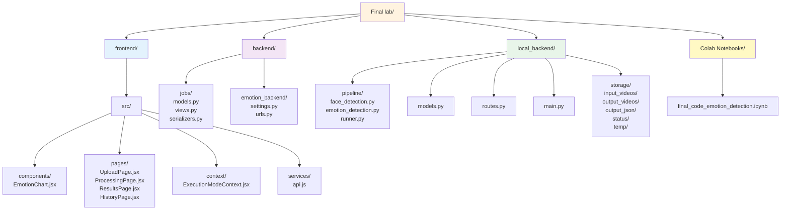
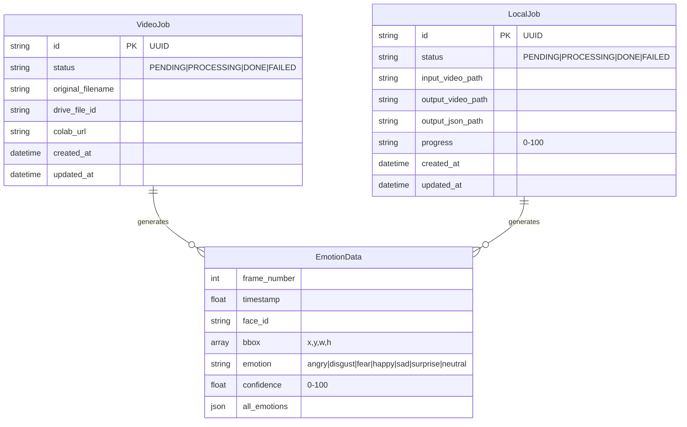
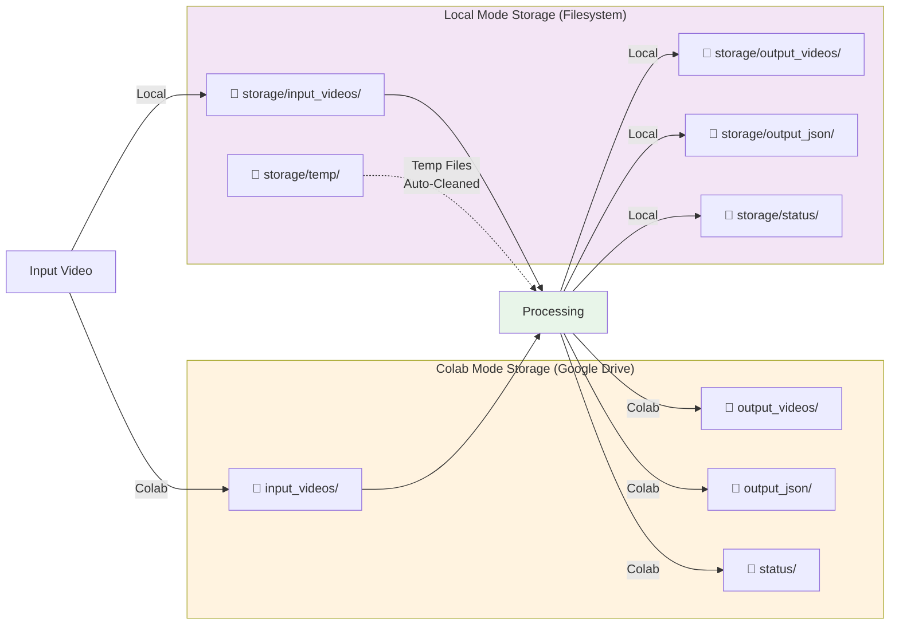

# 🏗️ System Architecture - Mermaid Diagrams

## Complete System Architecture



---

## AI/ML Processing Pipeline (Detailed)

```mermaid
flowchart TD
    Start([User Uploads Video]) --> Upload{Upload to<br/>Backend}
    
    Upload -->|Colab Mode| DjangoSave[Django Saves to<br/>Google Drive]
    Upload -->|Local Mode| FastAPISave[FastAPI Saves to<br/>Local Storage]
    
    DjangoSave --> CreateJobColab[Create VideoJob<br/>Status: PENDING]
    FastAPISave --> CreateJobLocal[Create LocalJob<br/>Status: PENDING]
    
    CreateJobColab --> ManualStart[User Opens Colab<br/>Clicks 'Run All']
    CreateJobLocal --> AutoStart[Pipeline Auto-Starts<br/>in Background Thread]
    
    ManualStart --> Pipeline
    AutoStart --> Pipeline
    
    subgraph Pipeline["Processing Pipeline (Identical for Both)"]
        direction TB
        
        Step1[Step 1: Face Detection<br/>━━━━━━━━━━━━━━━━━━━━<br/>Library: InsightFace<br/>Model: buffalo_l<br/>━━━━━━━━━━━━━━━━━━━━<br/>• Load model ~400MB<br/>• Process every frame<br/>• Detect faces 99.8% accuracy<br/>• Extract 512-dim embeddings<br/>• Track faces across frames<br/>━━━━━━━━━━━━━━━━━━━━<br/>Progress: 5% → 40%]
        
        Step1 --> Output1[Output: face_detections.json<br/>~1KB per 30 frames]
        
        Output1 --> Step2[Step 2: Emotion Detection<br/>━━━━━━━━━━━━━━━━━━━━<br/>Library: DeepFace<br/>Model: VGG-Face emotion<br/>━━━━━━━━━━━━━━━━━━━━<br/>• Load model ~15MB<br/>• Crop face regions<br/>• Analyze 7 emotions<br/>• Apply 5-sec smoothing<br/>• Filter confidence > 30%<br/>━━━━━━━━━━━━━━━━━━━━<br/>Progress: 45% → 85%]
        
        Step2 --> Output2[Output: emotions.json<br/>~2KB per 30 frames]
        
        Output2 --> Step3[Step 3: Video Annotation<br/>━━━━━━━━━━━━━━━━━━━━<br/>Library: OpenCV<br/>━━━━━━━━━━━━━━━━━━━━<br/>• Draw bounding boxes<br/>• Add emotion labels<br/>• Add confidence scores<br/>• Encode H264 codec<br/>━━━━━━━━━━━━━━━━━━━━<br/>Progress: 90% → 95%]
        
        Step3 --> Output3[Output: annotated_video.mp4<br/>~1.5x original size]
    end
    
    Output3 --> PostProcess[Post-Processing<br/>━━━━━━━━━━━━━━━━━━━━<br/>• Convert to H264<br/>• Move to final location<br/>• Clean temp files<br/>• Update DB status: DONE<br/>━━━━━━━━━━━━━━━━━━━━<br/>Progress: 100%]
    
    PostProcess --> Done([User Downloads Results])
    
    style Step1 fill:#e3f2fd
    style Step2 fill:#fff3e0
    style Step3 fill:#f3e5f5
    style Output1 fill:#c8e6c9
    style Output2 fill:#c8e6c9
    style Output3 fill:#c8e6c9
    style PostProcess fill:#ffecb3
```



---

## Emotion Categories



---

## Data Flow Sequence



---

## Technology Stack



---

## File Structure



---

## Processing Performance Comparison

```mermaid
gantt
    title Video Processing Time Comparison (1-minute video @ 30 FPS)
    dateFormat X
    axisFormat %s
    
    section GPU (Colab)
    Face Detection (GPU)    :0, 30s
    Emotion Detection (GPU) :30s, 45s
    Video Annotation (GPU)  :45s, 60s
    Post-Processing (GPU)   :60s, 90s
    
    section CPU (Local)
    Face Detection (CPU)    :0, 120s
    Emotion Detection (CPU) :120s, 240s
    Video Annotation (CPU)  :240s, 270s
    Post-Processing (CPU)   :270s, 300s
```

---

## Database Models



---

## Storage Architecture



---

*Last Updated: January 3, 2026*
